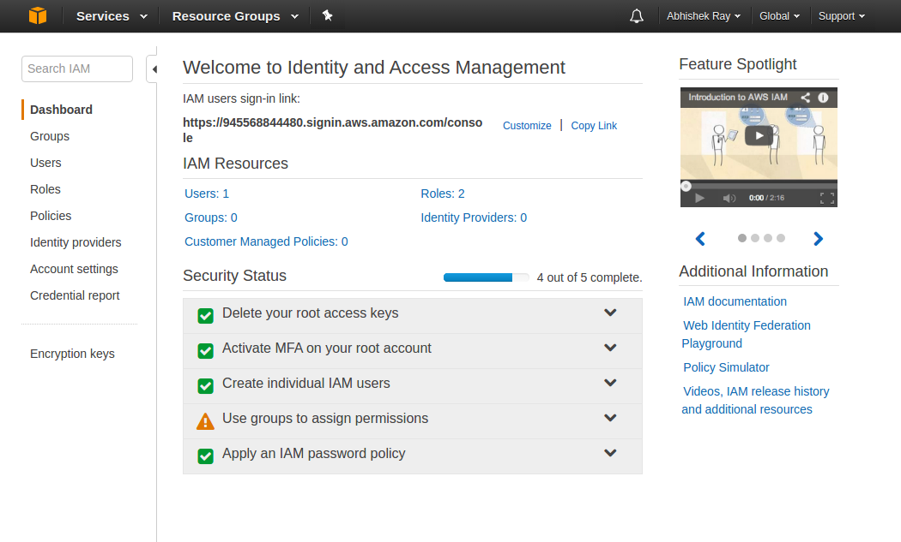
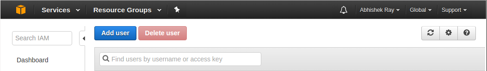
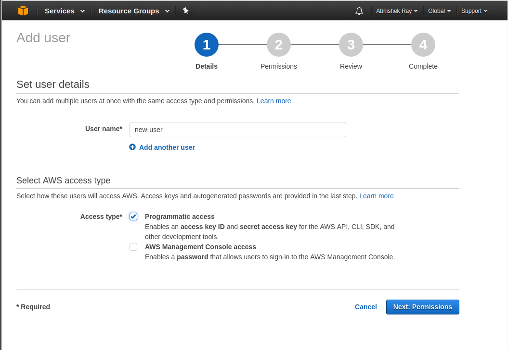
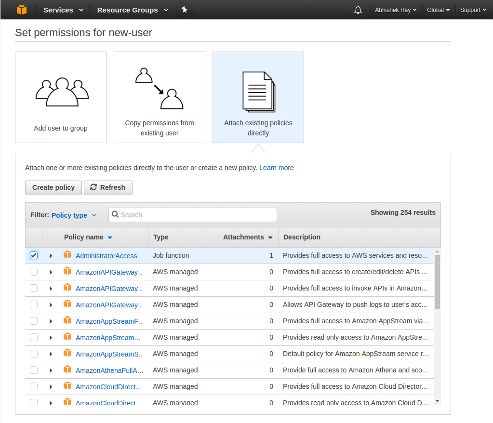
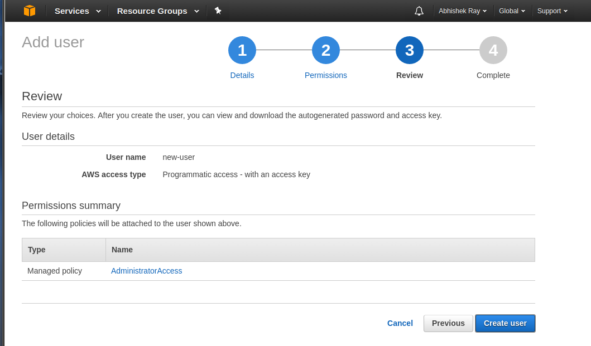
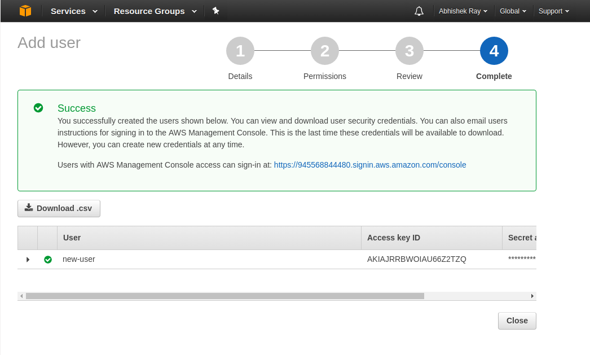

# Creating an IAM User on AWS

### What is IAM?

AWS Identity & Access Management (IAM) is used to control access to AWS services and resources. Using IAM, we can create and manage AWS users and groups.

We will be using IAM in this tutorial to create a new user and give them API access to the services we need.

### Steps to create a new IAM User

1. Go to the IAM console at https://console.aws.amazon.com/iam/home

2. Click on the Users link on the left menu.

  

3. If there are no existing users, click on Add user at the top.

  

4. Enter a username for the new user and also check the box for programmatic access and then click Next.

  

5. On the permissions page, give this new user Administrator Access.

  

6. Click on Create User.

  

7. Once your user has been created, don't forget to click on the **Download .csv** button. This file has the access key and secret key we need to access the AWS APIs.

  

8. The format of the csv file would something like this:
```
  User name,Password,Access key ID,Secret access key,Console login link

  new-user,,YOUR_ACCESS_KEY,YOUR_SECRET_KEY,https://xxxx.signin.aws.amazon.com/console
```

9. Copy the columns with the titles *Access key ID* and *Secret access key* and store them in a file with the following format:
```
    [default]
    aws_access_key_id=YOUR_ACCESS_KEY
    aws_secret_access_key=YOUR_SECRET_KEY
```

The file should be stored at the following location: `~/.aws/credentials`. You might have to first create the `~/.aws` folder before being able to save the file.

The credentials file will be used by the AWS API to authenticate any requests.
